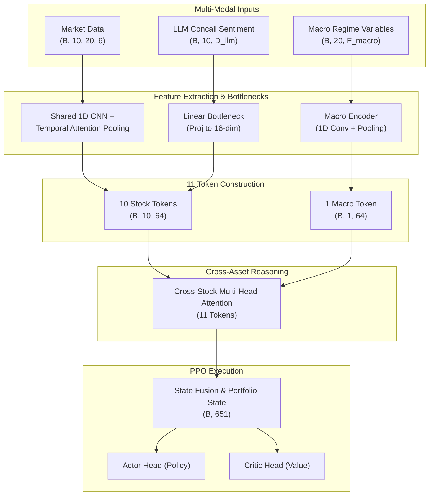
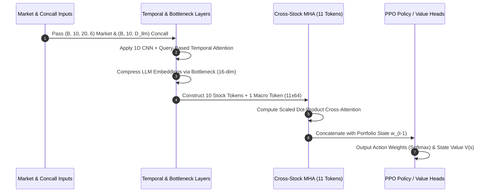

## Executive Summary

Standard quantitative portfolio allocation models frequently suffer from two structural flaws:

1. **Temporal Information Loss:** Flattening time series features over a lookback window destroys temporal invariance, while uniform average pooling dilutes recent price momentum.
2. **Single-Asset Isolation:** Evaluating individual stock dynamics independently ignores inter-asset sector spillovers, macro regime shifts, and cross-asset correlations.

The **DeepRL Portfolio Allocator** resolves these limitations through a custom multi-modal PPO architecture. By combining high-frequency market price action (OHLCV), low-frequency qualitative sentiment extracted from earnings call transcripts (LLM-based), and global macroeconomic regime indicators (VIX, yield curves, interest rates), the system dynamically optimizes risk-adjusted returns across a 10-stock portfolio plus cash.

---

## High-Level System Architecture



## 1. Mathematical Formulation & State Space Definition

The environment state space $\mathcal{S}_t$ at time step $t$ is formulated as a dictionary space containing four distinct modalities:

$$\mathcal{S}_t = \{ \mathbf{X}^{\text{market}}_t, \mathbf{X}^{\text{macro}}_t, \mathbf{X}^{\text{concall}}_t, \mathbf{w}_{t-1} \}$$

* **Market Tensor ($\mathbf{X}^{\text{market}}_t \in \mathbb{R}^{B \times 10 \times 20 \times 6}$):** OHLCV and technical indicators across 10 stocks over a 20-day sliding lookback window.
* **Macro Tensor ($\mathbf{X}^{\text{macro}}_t \in \mathbb{R}^{B \times 20 \times F_{\text{macro}}}$):** Shared global regime indicators (e.g., VIX, yield curves, interest rates, exchange rates) over 20 days.
* **Concall Feature Matrix ($\mathbf{X}^{\text{concall}}_t \in \mathbb{R}^{B \times 10 \times D_{\text{llm}}}$):** Decay-weighted qualitative sentiment vectors extracted from quarterly earnings call transcripts using LLM embeddings.
* **Portfolio State ($\mathbf{w}_{t-1} \in \mathbb{R}^{B \times 11}$):** Prior allocation weights across 10 assets plus the uninvested cash position.

---

## 2. Deep Neural Network Pipeline



### Module 1: Query-Based Temporal Attention Pooling

To capture localized price patterns without destroying time-shift invariance, each stock's 20-day sequence passes through a shared 1D Convolutional network followed by query-based temporal attention:

1.  **Convolutional Feature Mapping:**

    $$H_s = \text{ReLU}\left(\text{Conv1D}(X_s^{\text{market}})\right) \in \mathbb{R}^{(B \cdot 10) \times C \times 20}$$

2.  **Temporal Attention Weights:**

    $$\mathbf{a}_s = \text{Softmax}\left( \tanh(H_s^T W_k) \mathbf{q} \right) \in \mathbb{R}^{(B \cdot 10) \times 20}$$

    $$\mathbf{e}_s = \sum_{t=1}^{20} a_{s, t} \cdot H_{s, t} \in \mathbb{R}^{(B \cdot 10) \times C}$$

### Module 2: Decayed LLM Sentiment Bottleneck

To prevent high-dimensional textual embeddings ($D_{\text{llm}} = 768$) from dominating policy gradients over price action signals during vector dot products, textual features undergo low-rank projection and layer normalization:

$$\mathbf{c}_s = \text{LayerNorm}\left( \text{ReLU}( W_c \mathbf{X}^{\text{concall}}_s + b_c ) \right) \in \mathbb{R}^{(B \cdot 10) \times 16}$$

The 64-dimensional market embedding $\mathbf{e}_s$ and 16-dimensional qualitative embedding $\mathbf{c}_s$ are concatenated and projected back to 64 dimensions prior to cross-asset attention.

### Module 3: "11th Token" Macro Integration & Cross-Stock MHA

Macro features are encoded into a single regime token $\mathbf{m} \in \mathbb{R}^{B \times 16}$ via 1D Convolution and Adaptive Average Pooling, then projected to 64 dimensions.

1.  **Token Construction:** 10 Stock Embeddings + 1 Macro Regime Token = 11 Tokens $\in \mathbb{R}^{B \times 11 \times 64}$.

2.  **Cross-Asset Scaled Dot-Product Attention:**

    $$\text{Attention}(Q, K, V) = \text{Softmax}\left(\frac{QK^T}{\sqrt{d_k}}\right)V$$

This allows the policy to dynamically evaluate individual stock sensitivity relative to other assets and global market regimes simultaneously.

## 3. Custom PyTorch Feature Extractor Implementation

Below is the PyTorch implementation of the `BaseFeaturesExtractor` integrating the multi-modal fusion and "11th Token" Cross-Stock Multi-Head Attention:

Python

```
import torch
import torch.nn as nn
import torch.nn.functional as F
from stable_baselines3.common.torch_layers import BaseFeaturesExtractor
from gymnasium import spaces

class MultiModalCrossStockExtractor(BaseFeaturesExtractor):
    def __init__(self, observation_space: spaces.Dict, features_dim: int = 651):
        super().__init__(observation_space, features_dim)

        # 1. Market 1D Conv + Temporal Attention
        self.market_conv = nn.Conv1d(in_channels=6, out_channels=64, kernel_size=3, padding=1)
        self.temporal_query = nn.Parameter(torch.randn(64, 1))
        self.temporal_key = nn.Linear(64, 64)

        # 2. LLM Concall Bottleneck Projection
        self.concall_bottleneck = nn.Sequential(
            nn.Linear(768, 16),
            nn.ReLU(),
            nn.LayerNorm(16)
        )
        self.stock_projector = nn.Linear(64 + 16, 64)

        # 3. Macro Regime Encoder ("11th Token")
        self.macro_encoder = nn.Sequential(
            nn.Conv1d(in_channels=10, out_channels=32, kernel_size=3, padding=1),
            nn.ReLU(),
            nn.AdaptiveAvgPool1d(1),
            nn.Flatten(),
            nn.Linear(32, 64)
        )

        # 4. Cross-Stock Multi-Head Attention (11 Tokens)
        self.cross_mha = nn.MultiheadAttention(embed_dim=64, num_heads=4, batch_first=True)

    def forward(self, observations: dict) -> torch.Tensor:
        batch_size = observations["market"].shape[0]

        # Process Market Data: (B, 10, 20, 6) -> (B * 10, 6, 20)
        x_mkt = observations["market"].view(-1, 20, 6).transpose(1, 2)
        h_mkt = F.relu(self.market_conv(x_mkt))  # (B * 10, 64, 20)

        # Temporal Attention Pooling
        keys = torch.tanh(self.temporal_key(h_mkt.transpose(1, 2)))  # (B * 10, 20, 64)
        attn_logits = torch.matmul(keys, self.temporal_query).squeeze(-1) # (B * 10, 20)
        attn_weights = F.softmax(attn_logits, dim=-1).unsqueeze(1)       # (B * 10, 1, 20)
        e_market = torch.bmm(attn_weights, h_mkt.transpose(1, 2)).squeeze(1) # (B * 10, 64)
        e_market = e_market.view(batch_size, 10, 64)

        # Process LLM Concall Bottleneck
        x_llm = observations["concall"]  # (B, 10, 768)
        c_llm = self.concall_bottleneck(x_llm)  # (B, 10, 16)

        # Combine Stock Embeddings
        stock_tokens = self.stock_projector(torch.cat([e_market, c_llm], dim=-1)) # (B, 10, 64)

        # Process Macro Token ("11th Token")
        x_macro = observations["macro"].transpose(1, 2) # (B, F_macro, 20)
        macro_token = self.macro_encoder(x_macro).unsqueeze(1) # (B, 1, 64)

        # Concatenate 10 Stock Tokens + 1 Macro Token
        combined_tokens = torch.cat([stock_tokens, macro_token], dim=1) # (B, 11, 64)

        # Cross-Stock Multi-Head Attention
        attn_out, _ = self.cross_mha(combined_tokens, combined_tokens, combined_tokens) # (B, 11, 64)

        # Extract stock tokens and flatten
        fused_stocks = attn_out[:, :10, :].reshape(batch_size, -1) # (B, 640)
        portfolio_state = observations["portfolio_state"]          # (B, 11)

        # Output State Vector for Actor/Critic Heads
        return torch.cat([fused_stocks, portfolio_state], dim=-1)   # (B, 651)

```

## 4. PPO Optimization & Diagnostic Guardrails

To ensure policy stability during PPO updates, training rollouts are continuously audited via custom diagnostic callbacks:

1.  **Attention Entropy Monitoring:**

    $$\mathcal{H}(\mathbf{a}) = -\sum_{i} a_i \log(a_i + \epsilon)$$

    Monitored within **$1.5 - 2.5$ nats** to prevent uniform attention degradation or single-day attention collapse.

2.  **Gradient Norm Clipping:** Clipped at **$<0.5$** across attention layers to eliminate policy instability caused by high volatility price spikes.

## Technical Stack

-   **RL Framework:** Stable-Baselines3 (PPO), Gymnasium

-   **Deep Learning:** PyTorch (`BaseFeaturesExtractor`, MultiHead Attention, Conv1D)

-   **LLM Pipeline:** Decay-weighted sentiment extraction from earnings call transcripts

-   **Monitoring:** TensorBoard, Custom Diagnostics Callbacks
